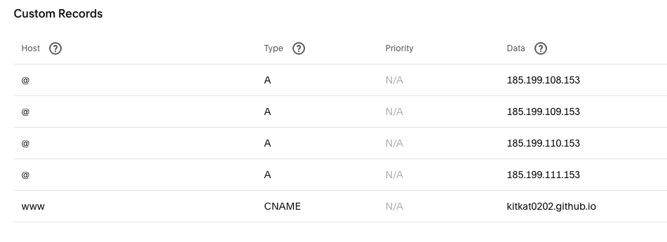

### How to run
`npm i`
`npm start`

### For new developers of Reimagin Food Fest site
the videos in the src file is deleted, to fix:
 - take the "videos" folder from `build > assets > img` and make a copy at `src > assets > img`

### How to deploy
If its this sites FIRST deployment:
 - after you have pushed all your changes to main branch run:
`npm run gh-deploy-init`
 - once all deployment is complete go to the repo -> settings -> pages -> custom domain and paste:
`reimaginefoodfest.com`
 - Set up the DNS settings in you domain site

If its NOT the first:
 - after you have pushed all your changes to main branch run:
`npm run gh-deploy` (this will push the build folder to the gh-pages branch where the website is at, DONOT need to change branches stay in main branch when doing this)
 - usually deeploymeent happens every 10 minutes

### How wo set up the DNS
(if on square space remove the default domanins - tutorial: https://www.mloning.com/posts/configuring-custom-domain-with-github-pages-and-squarespace/)
 - add the A records and thee CNAME to domain provider, like:

### Check propogation of DNS through internet
- https://www.whatsmydns.net/#CNAME/www.reimaginefoodfest.com